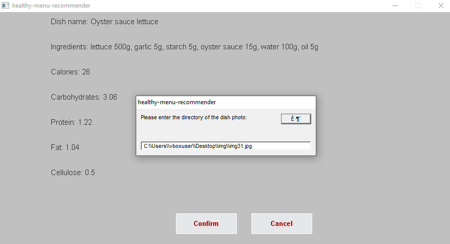
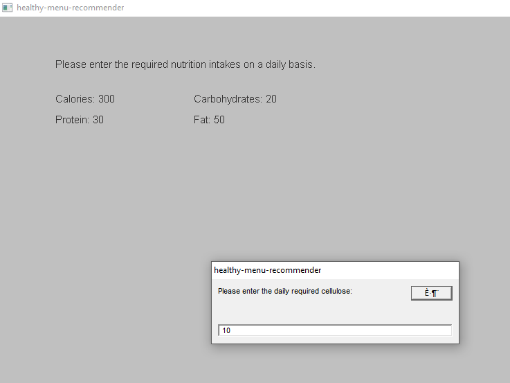
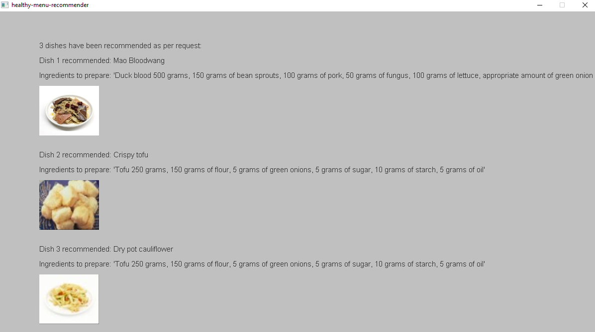
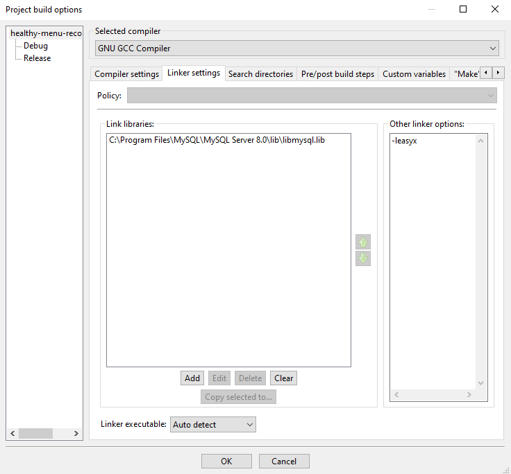
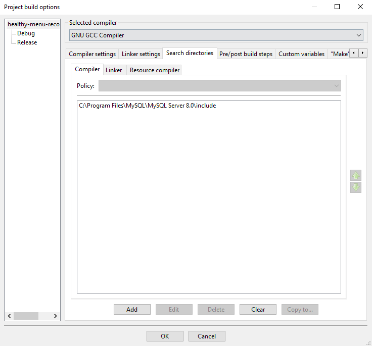

# HEALTHY MENU RECOMMENDER EASYX

The simple menu recommender system aims to recommend combination of dishes based on users' daily need of nutrition.

The main interface looks as follows.


User can add new dish to the system after entering the dish information.


A combination of 3 dishes will be recommended after user specifies his or her daily nutrition requirement.



## Install EasyX on Windows + CodeBlocks

1. [Download and configure EasyX for CodeBlocks](https://codebus.cn/bestans/easyx-for-mingw)
2. [Configure MySQL for CodeBlocks](https://blog.csdn.net/weixin_42355492/article/details/100745355). The correct configuration of linker settings and search directories within CodeBlocks should look as follows.


3. Be sure to **Save everything** in CodeBlocks to ensure all the configurations remain saved. 

## (Not recommended) Install <graphics.h> on Linux

### Installation procedures
[Reference](https://stackoverflow.com/questions/67636061/unable-to-install-libgraph-in-linux-ubuntu-20-04)

```
$ sudo apt-get install libsdl-image1.2 libsdl-image1.2-dev guile-2.2 guile-2.2-dev 
$ wget http://download.savannah.gnu.org/releases/libgraph/libgraph-1.0.2.tar.gz
$ tar -xzvf libgraph-1.0.2.tar.gz
$ cd libgraph-1.0.2
$ CPPFLAGS="$CPPFLAGS $(pkg-config --cflags-only-I guile-2.2) -fcommon" \
CFLAGS="$CFLAGS $(pkg-config --cflags-only-other guile-2.2) -fcommon" \
LDFLAGS="$LDFLAGS $(pkg-config --libs guile-2.2)" \
./configure
$ make && sudo make install
$ sudo cp /usr/local/lib/libgraph.* /usr/lib
```

### Test of the setup

```
$ g++ -o filename filename.cpp -lgraph
$ ./filename
```

## (Not recommended) Install EasyX on Linux
[GUN/Linux 下使用 EasyX](https://www.cnblogs.com/aaroncoding/p/17116879.html)


## Enable database development (MySQL)
```
$ sudo apt-get install libmysqlclient-dev
```

- [how to use <Windows.h> c++](https://www.linux.org/threads/how-to-use-windows-h-c.28353/)
- To display utf-8 characters in terminal: `chcp 936` 
